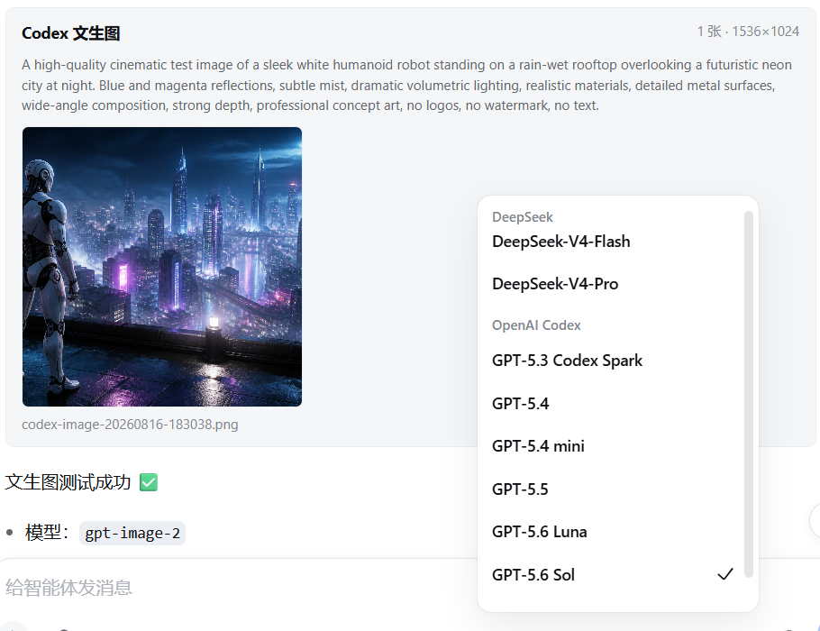

# Codex Connect Plus

[](https://github.com/stoneface10/dsh-codex-connect-plus/releases)
[](../LICENSE)

[English](../README.md) | 中文

<p align="center">
  
</p>

> **把你的 ChatGPT/Codex 订阅接入 DeepSeek Harness：直接选择 Codex 模型，并使用 `gpt-image-2` 文生图/编辑，无需 OpenAI Platform API Key。**

只需完成一次 ChatGPT OAuth 登录。Codex 模型请求使用已登录账户的订阅额度；图片生成/编辑使用同一 OAuth 会话，但实际可用性和额度可能由账户、地区、限制及上游策略分别决定。

### 一眼看懂

- **Codex 模型进入 DSH 普通模型选择器**：无需额外切换到 Codex CLI 工作流。
- **`gpt-image-2` 文生图与图片编辑**：可从提示词生成图片，也可编辑 1–8 张本地参考图；结果在聊天内预览并保存到本地。
- **无需 OpenAI Platform API Key 或按量 API 计费配置**：授权来自用户主动登录的 ChatGPT/Codex OAuth 会话。
- **默认节省订阅额度**：模型自动重试默认为 `0`，图片请求不会静默重试。

<p align="center">
  
</p>
<p align="center"><sub>真实 DSH 界面：在同一会话中选择 Codex 模型，并通过 <code>gpt-image-2</code> 生成聊天附件。</sub></p>

> 社区派生版本，与 OpenAI、DeepSeek 以及上游 Codex Connect 维护者不存在隶属或背书关系。

## 功能

- ChatGPT/Codex OAuth 登录和 provider 原生自动刷新。
- 通过 Harness 标准 LLM 服务提供 OpenAI Codex 模型目录。
- 可选的 Codex 独立搜索提供方。
- 可选的 `view_image` 工具。
- `codex_image_generate`：一次生成 1–4 张 `gpt-image-2` 图片。
- `codex_image_edit`：使用 1–8 张 PNG/JPEG/WebP 参考图及可选 mask 编辑。
- DSH 持久附件、会话授权回放、聊天内预览，以及 `outputs/codex-image` 本地输出。
- 固定请求源、禁止重定向、输入/响应限制、取消与超时、图片签名验证、错误脱敏。

## 版本要求

- **DeepSeek Harness `0.1.1-rc.2`。** 本构建面向 rc.2 Client API；DSH `0.1.2-alpha.1` 必须改用插件 `0.1.0-beta.6`。
- Node.js `^22.19.0 || >=24.0.0`。

| DSH 版本 | 兼容插件 | npm 安装标识 |
| --- | --- | --- |
| `0.1.0-rc.5` / `0.1.0-rc.6` | `0.1.0-beta.2` | `dsh-codex-connect-plus@0.1.0-beta.2` |
| `0.1.0-rc.7` | `0.1.0-beta.4` | `dsh-codex-connect-plus@0.1.0-beta.4` |
| `0.1.1-rc.2` | `0.1.0-beta.5` | `dsh-codex-connect-plus@latest` |
| `0.1.2-alpha.1` | `0.1.0-beta.6` | `dsh-codex-connect-plus@beta` |

## 安装

DSH `0.1.1-rc.2` 默认安装 npm `latest`：

```sh
dsh plugin --profile web add dsh-codex-connect-plus@latest
```

不可变 GitHub 备用安装方式：

```sh
dsh plugin --profile web add 'github:stoneface10/dsh-codex-connect-plus#v0.1.0-beta.5'
```

GitHub 预发布中也附带了对应的 `.tgz`。

本地开发链接：

```sh
dsh plugin --profile web add link:/absolute/path/to/dsh-codex-connect-plus
```

不要在同一 profile 同时安装 `dsh-codex-connect`、`dsh-codex-image-connect` 与本融合包，它们拥有相同的 provider 和工具名。

## 配置

打开 **设置 → 插件 → 插件配置 → Codex Connect Plus**。

1. 使用 ChatGPT 登录。
2. 选择需要的可选能力。
3. 保存 profile 配置。

默认能力与额度安全配置：

```yaml
modelMaxRetries: 0
enableSearch: false
enableImageTool: false
enableImageGeneration: true
```

插件不会接管默认模型或全局搜索路由。`modelMaxRetries: 0` 可避免瞬时失败后静默重放整次订阅请求；当可靠性比额度节省更重要时，用户可以在插件配置中显式选择重试 1–2 次。图片生成/编辑继续保持不重试，因为超时请求可能已被上游处理。如果直接多模态上传和 DSH 原生 `read_image` 已能覆盖工作流，请保持 `enableImageTool` 关闭；仅在模型必须直接打开不含凭据的公网 HTTP(S) 图片 URL 时启用。

## 图片工具

```text
使用 codex_image_generate 生成一张高质量竖版旅游海报。
```

```text
使用 codex_image_edit 和 refs ["photo.png"] 替换背景。
```

生成文件以当前 DSH 会话 cwd 为基准，保存在：

```text
outputs/codex-image/
```

每张参考图最大 4 MB，单次编辑最多 8 张。生成可能需要数分钟；超时或网络失败不会自动重试，因为上游可能已经处理请求。

## 安全与接口状态

- OAuth 凭据保存在 DSH 专用凭据文件中；在 POSIX 系统上，插件会检查仅所有者可访问权限。请勿复制、提交或公开该文件。
- Token 刷新由 pi-ai Codex provider 通过带锁的凭据存储完成；图片模块本身不保存或刷新 Refresh Token。
- 图片请求只发送到代码中固定的 HTTPS ChatGPT/Codex 应用端点，并拒绝 HTTP 重定向。
- 对外显示提供商错误前，会限制错误长度，并隐藏已识别的 Bearer Token、JWT、授权/Token 字段、`b64_json` 和图片 Data URL。
- 生成图片附件只能通过所属 DSH 会话授权读取；插件不提供公开附件读取接口。

Codex Images 使用未公开、可能变化的 ChatGPT/Codex 应用后端，并非 OpenAI Platform 的公开或受支持 API。功能可能随上游变更而失效；实际可用性取决于账号权限、订阅、地区、额度和上游策略。使用者应自行遵守适用的服务条款。

## 开发与发布

```sh
pnpm install
pnpm run check
npm pack --dry-run
```

本仓库与上游一致，同时提交 `src/` 和构建后的 `lib/`。npm/GitHub Release 的 `.tgz` 只包含运行文件与文档，不包含源码、测试、脚本、凭据、日志或本地输出。

重试、缓存、压缩与子代理额度优化见 [Token 与订阅额度优化报告](USAGE-QUOTA-OPTIMIZATION.zh.md)。

## 法律与来源

本项目派生自 [dsh-codex-connect](https://github.com/franksong2702/dsh-codex-connect)，该项目又包含 [Yan-Zero/dsh-codex](https://github.com/Yan-Zero/dsh-codex) 的派生工作。

图片生成和会话图片 UI 包含对 [dsh-image2-draw](https://github.com/JuneLearn/dsh-image2-draw) 与 [codex-gpt-image](https://github.com/ningzimu/codex-gpt-image) 的适配，并保留 [dsh-multimodal](https://github.com/MC5lan/dsh-multimodal) 的传递署名。

详见 [`NOTICE`](../NOTICE) 和 [`THIRD_PARTY_NOTICES.md`](../THIRD_PARTY_NOTICES.md)。

## 许可证

Apache-2.0。第三方适配部分继续遵守 [`THIRD_PARTY_NOTICES.md`](../THIRD_PARTY_NOTICES.md) 中对应条款。
